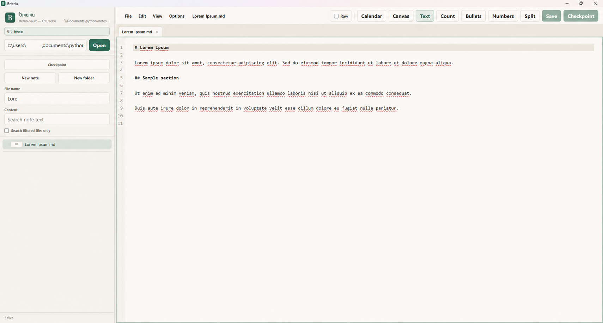

# Bricriu

<p align="center">
  
</p>

Bricriu is a local-first desktop workspace for Markdown notes—and more. Open a folder as a vault, browse and search it, edit several files at once, and save your work as ordinary files that remain usable without Bricriu. Alongside its Markdown-centered workflow, Bricriu is experimenting with Typst documents, visual canvases, a vault calendar, and rich-text editing and review.

**Open-source acknowledgements:** Bricriu is possible because of [Tauri](https://tauri.app/), [Rust](https://www.rust-lang.org/), [React](https://react.dev/), [CodeMirror](https://codemirror.net/), [Vite](https://vite.dev/), [Typst](https://typst.app/), [Tiptap](https://tiptap.dev/) and [ProseMirror](https://prosemirror.net/), [React Flow](https://reactflow.dev/), [FullCalendar](https://fullcalendar.io/), [markdown-it](https://github.com/markdown-it/markdown-it), [mdit-plugins](https://github.com/mdit-plugins/mdit-plugins), [KaTeX](https://katex.org/), [nspell](https://github.com/wooorm/nspell), and the broader JavaScript and Rust ecosystems. The wordmark is rendered in Dominic Stanley's OFL-licensed [Segotia](https://github.com/insert-smiley/Irishfontclub-segotia); the squaremark is an unmodified rendering in Séamas Ó Brógáin's [Gadelica](https://www.gaelchlo.com/clonna2.html). The generated [third-party inventory](THIRD_PARTY_NOTICES.md) provides the fuller attribution and attributes every package in the current JavaScript and Rust dependency graphs, including transitive, build, optional, and platform-specific dependencies.

[Xueqing Zhai](https://github.com/jess-zhai) built the initial prototypes, whose ideas were later absorbed into Bricriu.

Bricriu was vibe-coded with OpenAI Codex and then used and tested for roughly six months by one user. The source has evolved through real use, but its bus factor, device coverage, test population, accessibility review, security review, and packaging coverage are all minimal.

> [!CAUTION]
> **Back up your notes before trying this app.** Keep the vault in Git and commit regularly, or use another independent, versioned backup. Autosave, app-created Git checkpoints, and the experimental encrypted-private-folder feature are not backups. This pre-release software is provided as-is; to the maximum extent permitted by law, its author and contributors accept no responsibility for lost, overwritten, corrupted, exposed, or otherwise damaged notes or data.

> [!WARNING]
> Only the ordinary Markdown workflow has received even modest real-world testing: approximately six months of use by **one person** in a Windows-oriented development environment. That is not broad or professional QA. Typst, Track Changes, Canvas, Calendar, Git automation, private-folder encryption, packaging, and all macOS/Linux behavior should be treated as **very experimental**.



## Features

The Markdown-centered workflow includes:

- Folder-based vaults with no proprietary note database.
- A nested file tree with filename filtering, pinned notes, and create, rename, and delete actions.
- Fast non-indexed content search with file-filter scoping and jump-to-match highlighting.
- Multiple tabs, a resizable two-file split view, recent files, and session/window restoration.
- Classic, brighter high-contrast, and dark interface themes, selectable from **Options → Theme**.
- A CodeMirror 6 Markdown editor with manual save, delayed autosave, undo/redo, Canadian-English spellcheck, word/character counts, list helpers, and URL linkification.
- Filesystem watching, external-change warnings, and save-conflict checks.
- Wiki links (`[[Note]]`), link completion, backlinks, callouts, and inline/block KaTeX math.
- A split Markdown preview with escaped raw HTML, printing, and PDF workflows.

Experimental features extend the workspace beyond the core Markdown editor:

- Typst editing plus embedded SVG/HTML preview and PDF export.
- A Tiptap/ProseMirror rich-text editor and review mode, currently backed by Markdown files, with Track Changes snapshots, accept/reject tools, and sidecar state.
- A YAML-backed visual Canvas stored inside Markdown files.
- A vault-local Calendar with recurring events.
- Git checkpoint commits on an app-managed `inuse` branch.
- Password-protected AES-256 ZIP archives for an optional `.h/` private area.

Bricriu currently recognizes `.md`, `.markdown`, and `.typ` files. **Only `.md` and `.markdown` files are in the somewhat-tested path.** Other file types in a vault are not general-purpose editable documents.

## Status and scope

This is personal pre-release software at version `0.1.0`, not a polished or audited product.

The design is deliberately local-first:

- Notes stay in the folder you choose.
- No account, cloud sync service, or proprietary storage format is required.
- Rust owns filesystem, search, watcher, Git, encryption, and document-compilation work.
- React and TypeScript own the interface and editor behavior.
- Paths crossing the frontend/backend boundary are normally vault-relative and backend operations resolve them under the vault root.

Opening an individual document through **File → Open file** is an explicit exception: the app can edit a supported file outside the vault, but disables vault-only features for it.

## Why Bricriu?

We like trickster myths. We tried Anansi, Kokopelli, Loki, Puck, and Laverna, but they were all taken. So we used this one :)

Bricriu (approximately **BRICK-roo**) is named for the eloquent troublemaker and instigator of the Irish Ulster Cycle. The project borrows the name with respect for that tradition and does not claim ownership of the mythological figure. See [bricriu.md](bricriu.md) for the naming and preliminary trademark notes.

## Install

No signed, notarized, broadly tested release installers are published yet. For now, build from source using the [installation and build guide](install.md).

| Platform | Current advice |
| --- | --- |
| Windows 10/11 | The development and limited single-user testing path. Requires Node.js 22.12.0 or newer, Rust, Microsoft C++ Build Tools, and WebView2 to build. A future unsigned installer may trigger Windows warnings. |
| macOS | **Untested.** Build on macOS with Xcode Command Line Tools. Packaging, icons, signing, notarization, and runtime behavior still need validation. |
| Linux | **Untested.** Install the Tauri prerequisites for your distribution and build on Linux. WebKit/system-package requirements and generated packages still need validation. |

Quick development start after installing the platform prerequisites:

```sh
npm ci
npm run tauri:dev
```

On Windows, after `npm ci` has installed the locked dependencies, build the app executable with:

```powershell
.\build-exe.bat
```

`build-exe.bat` uses an installed Node.js 22.12.0-or-newer version for that build only. With NVM for Windows, it can find a suitable installed version even when an older Node version is active, and it does not persistently switch the active version. It does not install dependencies, so rerun `npm ci` after dependency-lock changes. The current Windows build has been verified with Node.js 22.14.0. It produces `src-tauri\target\release\Bricriu.exe`; this is the application executable, not an installer bundle.

The Markdown-It 15, KaTeX, and Tiptap 3 upgrades do not require a vault migration, a VS Code extension, or separately installed runtime plugins. Those libraries are bundled into Bricriu. Running the resulting executable does not require Node.js, npm, Rust, or the C++ build tools, although WebView2 and any feature-specific optional tools listed below are still runtime requirements.

Useful checks and builds:

```sh
npm run build
cargo check --manifest-path src-tauri/Cargo.toml
npm run tauri:build
```

The first Rust build is large and slow. Build distributable desktop packages on each target operating system rather than expecting normal cross-platform bundles from one machine.

Optional external tools:

- [Git](https://git-scm.com/) is required only for Git checkpoint features.
- Typst preview and Typst PDF export use the embedded compiler path.
- Direct Markdown **Export PDF** requires both [Pandoc](https://pandoc.org/) and the [Typst CLI](https://github.com/typst/typst) on `PATH`. Printing the preview uses the system print dialog instead.

## Start safely

1. Create a disposable folder with a few copied Markdown files; do not begin with your only copy of an important vault.
2. Run Bricriu and open that folder as the vault.
3. Verify edit, manual save, autosave, rename, delete, external-change, and recovery behavior on your machine.
4. Only then try a real vault that is independently backed up and, preferably, committed to Git.

The app writes note edits directly to disk. Depending on the features used, it may also create or modify:

- `.notesproject/` for app sidecars and Typst preview output;
- `.vault-calendar/events.json` for Calendar data;
- `.h.zip`, `.h/`, `.horig/`, local Git excludes, and Git hooks for private notes;
- Git branches, staged paths, and commits for checkpoints;
- `profile.json` and WebView local storage for preferences and session state.

For compatibility with development versions that predate the Bricriu name, internal storage keys and the `.notesproject/` metadata directory retain their original names. They are implementation details, not a second product name.

Read the [user guide](USER_GUIDE.md) before enabling Git automation or private notes.

## Technology

- **Desktop shell:** Tauri 2
- **Frontend:** React 18, TypeScript, Vite
- **Text editor:** CodeMirror 6
- **Native backend:** Rust
- **Markdown:** Markdown-It 15 with `@mdit/plugin-katex` 1, KaTeX 0.18.7, and CodeMirror Markdown language support
- **Rich review mode:** Tiptap 3 and ProseMirror
- **Canvas:** React Flow and YAML
- **Calendar:** FullCalendar
- **Typst:** embedded Typst crates plus vendored CodeMirror Typst language support
- **Search/watch/storage:** Rust `grep-*`, `ignore`, `regex`, `notify`, `serde`, and `zip` crates

See [THIRD_PARTY_NOTICES.md](THIRD_PARTY_NOTICES.md) for the complete dependency inventory and declared licenses.

## Documentation

- [Installation and build](install.md)
- [User guide](USER_GUIDE.md)
- [Security policy and security boundaries](SECURITY.md)
- [Warranty disclaimer and limitation of liability](DISCLAIMER.md)
- [Contributing](CONTRIBUTING.md)
- [Release checklist](RELEASING.md)
- [Third-party software inventory](THIRD_PARTY_NOTICES.md)

## Contributing

Bug reports and focused fixes are welcome. Please read [CONTRIBUTING.md](CONTRIBUTING.md) first. In particular, do not submit real notes, vault paths, passwords, decrypted `.h/` contents, or other personal data in issues, screenshots, logs, fixtures, or pull requests.

## License

Bricriu is free software licensed under the [GNU Affero General Public License, version 3 or later](LICENSE) (`AGPL-3.0-or-later`). You may use it commercially, copy it, and modify it, subject to the license's conditions. In particular, covered modified versions must remain under the AGPL, and users who interact with a modified version over a network must be offered its Corresponding Source.

**No warranty; limitation of liability:** Bricriu is experimental software supplied **“as is,” without warranty of any kind**. To the maximum extent permitted by applicable law, its copyright holders and contributors are not liable for claims or damages arising from its use or inability to be used, including lost, corrupted, overwritten, exposed, or inaccurately rendered data. Read the full [warranty and liability notice](DISCLAIMER.md) and Sections 15–17 of the [AGPL](LICENSE).

Third-party components remain under their own licenses; see [THIRD_PARTY_NOTICES.md](THIRD_PARTY_NOTICES.md).
