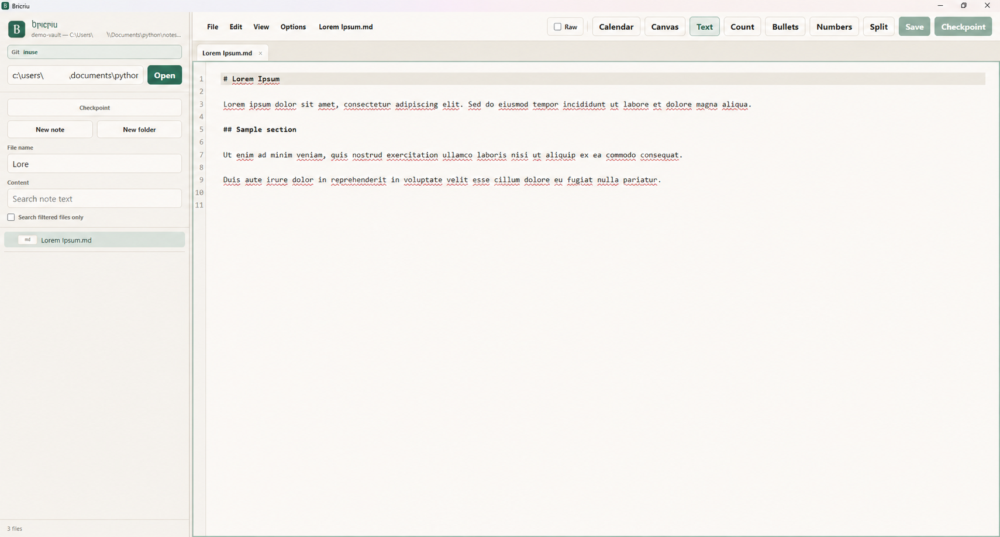

# Bricriu

<p align="center">
  
</p>

Bricriu is a local-first desktop workspace for Markdown notes—and more. Open a folder as a vault, browse and search it, edit several files at once, and save your work as ordinary files that remain usable without Bricriu. Alongside its Markdown-centered workflow, Bricriu is experimenting with Typst documents, visual canvases, a vault calendar, and rich-text editing and review.

**[User guide](USER_GUIDE.md)** · [First steps](#first-steps-windows) · [Download Windows installer](https://raw.githubusercontent.com/m2b3/Bricriu/main/Bricriu_0.1.0_x64-setup.exe) · [Installation and troubleshooting](install.md)

## First steps (Windows)

1. **Install.** Download [`Bricriu_0.1.0_x64-setup.exe`](https://raw.githubusercontent.com/m2b3/Bricriu/main/Bricriu_0.1.0_x64-setup.exe), double-click it, and follow the prompts. This experimental installer is for **64-bit Windows 10/11**. It is unsigned, so Windows may show an unknown-publisher or SmartScreen warning; see the [installation guide](install.md#install-on-windows-1011-x64). You do not need to clone the repository or install developer tools.
2. **Launch Bricriu.** Open **Bricriu** from the Start menu, or double-click its desktop shortcut if you created one during installation.
3. **Create a vault folder.** In File Explorer, create a folder such as `Documents\Bricriu Notes`. An empty folder is fine; you can also use a folder containing copied notes. A *vault* is simply the folder you choose for your notes—no account, import, or conversion is required. Start with disposable notes and keep an independent backup of important work.
4. **Open that folder.** In Bricriu's sidebar, clear **Vault folder path** and click **Open** to choose the folder. Alternatively, paste the folder's full path into that field and click **Open**. The folder must already exist.
5. **Write and save.** Click **New note**, enter `First note.md`, and click **Create**. Type something, then click **Save** or press `Ctrl+S`. Choose **View → Preview** to see the formatted Markdown. Your note is an ordinary file in the folder you chose.

Continue with the **[user guide](USER_GUIDE.md)** for editing, search, tabs, shortcuts, and experimental features. For another platform or a source build, see [Install](#install).

### Vault, no vault, and outside files

| Situation | What it means |
| --- | --- |
| **Vault open** | One folder is the workspace. Its supported files appear in the tree and vault searches; new notes are created there. The folder does not need to be a Git repository. |
| **No vault open** | No workspace folder has been selected or restored yet. **New note** and **File → Open file** require an open vault. Choose a folder to start. |
| **Outside vault** | After opening a vault, **File → Open file** can open a supported file elsewhere in its own tab. It stays at its original location and does not join the vault's search, backlinks, or Git checkpoints. |

To open an existing document directly from Windows, right-click it and choose **Open with → Bricriu**. If no vault is open, Bricriu automatically uses the file's folder, or the last vault if it contains that file. If a vault is already open, it stays selected. Installing Bricriu does not change your default editor, so double-clicking a document may still open another app. See [opening individual files](USER_GUIDE.md#open-an-individual-file).

## Supported files

| File type | What you can do |
| --- | --- |
| Markdown: `.md`, `.markdown` | Write notes with formatted preview, wiki links, backlinks, callouts, and math. This is the primary, somewhat-tested workflow. |
| Typst: `.typ` | Edit typesetting source, preview it, and export PDF. **Highly experimental.** |
| Plain text: `.txt`, `.csv`, `.json` | Edit the raw text and save with the original extension. CSV opens as text, not a spreadsheet; JSON has no dedicated structured editor. |

Canvas content lives inside Markdown files; Track Changes also works with Markdown and stores additional review state. Other file types are not general-purpose editable documents. See the [file-format details](USER_GUIDE.md#supported-file-types).

## Features

- **Organize and find:** folder tree, pinned notes, filename filtering, and vault-wide content search.
- **Write and read:** Markdown editing and preview, manual save and delayed autosave, spellcheck, word counts, wiki links, backlinks, callouts, and KaTeX math.
- **Work across notes:** multiple tabs, a resizable two-file split view, recent files, session restoration, and three interface themes.
- **Handle disk changes:** filesystem watching, external-change warnings, and save-conflict checks.
- **Print and export:** preview printing and PDF workflows; direct Markdown PDF export needs [optional tools](install.md#optional-runtime-tools).
- **Experiment:** Typst, rich-text Track Changes, visual Canvas, a vault Calendar, Git checkpoints, and encrypted private notes. These features have much less testing than ordinary Markdown editing.

The [user guide contents](USER_GUIDE.md#contents) link to instructions and limitations for each feature.



## Status and scope

This is personal pre-release software at version `0.1.0`, not a polished or audited product.

Bricriu was vibe-coded with OpenAI Codex and then used and tested for roughly six months by one user. The source has evolved through real use, but its bus factor, device coverage, test population, accessibility review, security review, and packaging coverage are all minimal.

> [!CAUTION]
> **Back up your notes before trying this app.** Keep the vault in Git and commit regularly, or use another independent, versioned backup. Autosave, app-created Git checkpoints, and the experimental encrypted-private-folder feature are not backups. This pre-release software is provided as-is; to the maximum extent permitted by law, its author and contributors accept no responsibility for lost, overwritten, corrupted, exposed, or otherwise damaged notes or data.

> [!WARNING]
> Only the ordinary Markdown workflow has received even modest real-world testing: approximately six months of use by **one person** in a Windows-oriented development environment. That is not broad or professional QA. Typst, Track Changes, Canvas, Calendar, Git automation, private-folder encryption, packaging, and all macOS/Linux behavior should be treated as **very experimental**.

The design is deliberately local-first:

- Notes stay in the folder you choose.
- No account, cloud sync service, or proprietary storage format is required.
- Rust owns filesystem, search, watcher, Git, encryption, and document-compilation work.
- React and TypeScript own the interface and editor behavior.
- Paths crossing the frontend/backend boundary are normally vault-relative and backend operations resolve them under the vault root.

Opening an individual document through **File → Open file** is an explicit exception: the app can edit a supported file outside the vault, but disables vault-only features for it.

## Why Bricriu?

We like trickster myths. We tried Anansi, Kokopelli, Loki, Puck, and Laverna, but they were all taken. So we used this one :)

Bricriu (approximately **BRICK-roo**) is named for the eloquent troublemaker and instigator of the Irish Ulster Cycle. The project borrows the name with respect for that tradition and does not claim ownership of the mythological figure. See [bricriu.md](bricriu.md) for the naming and preliminary trademark notes.

## Install

Bricriu now has an experimental installer for 64-bit Windows 10/11:

**[Download `Bricriu_0.1.0_x64-setup.exe`](https://raw.githubusercontent.com/m2b3/Bricriu/main/Bricriu_0.1.0_x64-setup.exe)**

The installer is not code-signed, so Windows may identify the publisher as unknown or show a Microsoft Defender SmartScreen warning. Only continue if you obtained the file from this repository or its official Releases page. The installer and its upgrade/uninstall behavior have received very limited testing; Bricriu itself remains pre-release software. Back up your notes and begin with a disposable vault.

Installing the Windows package does not require Node.js, npm, Rust, or Visual Studio Build Tools. Windows still needs the Microsoft Edge WebView2 Runtime, which is already present on most current Windows 10/11 systems. See the [installation and build guide](install.md) for step-by-step installation, uninstall, troubleshooting, and source-build instructions.

| Platform | Current advice |
| --- | --- |
| Windows 10/11 x64 | Use the experimental unsigned installer above. The app has only limited single-user testing, and Windows may show an unknown-publisher or reputation warning. |
| macOS | **Untested.** Build on macOS with Xcode Command Line Tools. Packaging, icons, signing, notarization, and runtime behavior still need validation. |
| Linux | **Untested.** Install the Tauri prerequisites for your distribution and build on Linux. WebKit/system-package requirements and generated packages still need validation. |

### Build from source

For a Windows build, install the [one-time prerequisites](install.md#windows-source-build-prerequisites), save your notes and close Bricriu, then run [build-install.bat](build-install.bat) from the repository folder:

```powershell
.\build-install.bat
```

This installs project dependencies, builds the app and installer, and launches the installer. See the [full script instructions](install.md#one-command-windows-build-and-install) for prerequisites and availability checks.

For development, install the platform prerequisites and run:

```sh
npm ci
npm run tauri:dev
```

The [installation and build guide](install.md) covers executable-only builds, installer packaging, platform prerequisites, optional tools, and troubleshooting. It also explains the [command-line launcher](install.md#open-a-file-from-the-command-line). See [Contributing](CONTRIBUTING.md) for development checks.

## Start safely

1. Create a disposable folder with a few copied Markdown files; do not begin with your only copy of an important vault.
2. Run Bricriu and open that folder as the vault.
3. Verify edit, manual save, autosave, rename, delete, external-change, and recovery behavior on your machine.
4. Only then try a real vault that is independently backed up and, preferably, committed to Git.

The app writes note edits directly to disk. Depending on the features used, it may also create or modify:

- `.notesproject/` for app sidecars and Typst preview output;
- `.vault-calendar/events.json` for Calendar data;
- `.h.zip`, `.h/`, `.horig/`, local Git excludes, and Git hooks for private notes;
- Git branches, staged paths, and commits for checkpoints;
- `profile.json` and WebView local storage for preferences and session state.

For compatibility with development versions that predate the Bricriu name, internal storage keys and the `.notesproject/` metadata directory retain their original names. They are implementation details, not a second product name.

Read the [user guide](USER_GUIDE.md) before enabling Git automation or private notes.

## Technology

- **Desktop shell:** Tauri 2
- **Frontend:** React 18, TypeScript, Vite
- **Text editor:** CodeMirror 6
- **Native backend:** Rust
- **Markdown:** Markdown-It 15 with `@mdit/plugin-katex` 1, KaTeX 0.18.7, and CodeMirror Markdown language support
- **Rich review mode:** Tiptap 3 and ProseMirror
- **Canvas:** React Flow and YAML
- **Calendar:** FullCalendar
- **Typst:** embedded Typst crates plus vendored CodeMirror Typst language support
- **Search/watch/storage:** Rust `grep-*`, `ignore`, `regex`, `notify`, `serde`, and `zip` crates

See [THIRD_PARTY_NOTICES.md](THIRD_PARTY_NOTICES.md) for the complete dependency inventory and declared licenses.

## Acknowledgements

**Open-source acknowledgements:** Bricriu is possible because of [Tauri](https://tauri.app/), [Rust](https://www.rust-lang.org/), [React](https://react.dev/), [CodeMirror](https://codemirror.net/), [Vite](https://vite.dev/), [Typst](https://typst.app/), [Tiptap](https://tiptap.dev/) and [ProseMirror](https://prosemirror.net/), [React Flow](https://reactflow.dev/), [FullCalendar](https://fullcalendar.io/), [markdown-it](https://github.com/markdown-it/markdown-it), [mdit-plugins](https://github.com/mdit-plugins/mdit-plugins), [KaTeX](https://katex.org/), [nspell](https://github.com/wooorm/nspell), and the broader JavaScript and Rust ecosystems. The wordmark is rendered in Dominic Stanley's OFL-licensed [Segotia](https://github.com/insert-smiley/Irishfontclub-segotia); the squaremark is an unmodified rendering in Séamas Ó Brógáin's [Gadelica](https://www.gaelchlo.com/clonna2.html). The generated [third-party inventory](THIRD_PARTY_NOTICES.md) provides the fuller attribution and attributes every package in the current JavaScript and Rust dependency graphs, including transitive, build, optional, and platform-specific dependencies.

[Xueqing Zhai](https://github.com/jess-zhai) built the initial prototypes, whose ideas were later absorbed into Bricriu.

## Documentation

- [Installation and build](install.md)
- [User guide](USER_GUIDE.md)
- [Security policy and security boundaries](SECURITY.md)
- [Warranty disclaimer and limitation of liability](DISCLAIMER.md)
- [Contributing](CONTRIBUTING.md)
- [Release checklist](RELEASING.md)
- [Third-party software inventory](THIRD_PARTY_NOTICES.md)

## Contributing

Bug reports and focused fixes are welcome. Please read [CONTRIBUTING.md](CONTRIBUTING.md) first. In particular, do not submit real notes, vault paths, passwords, decrypted `.h/` contents, or other personal data in issues, screenshots, logs, fixtures, or pull requests.

## License

Bricriu is free software licensed under the [GNU Affero General Public License, version 3 or later](LICENSE) (`AGPL-3.0-or-later`). You may use it commercially, copy it, and modify it, subject to the license's conditions. In particular, covered modified versions must remain under the AGPL, and users who interact with a modified version over a network must be offered its Corresponding Source.

**No warranty; limitation of liability:** Bricriu is experimental software supplied **“as is,” without warranty of any kind**. To the maximum extent permitted by applicable law, its copyright holders and contributors are not liable for claims or damages arising from its use or inability to be used, including lost, corrupted, overwritten, exposed, or inaccurately rendered data. Read the full [warranty and liability notice](DISCLAIMER.md) and Sections 15–17 of the [AGPL](LICENSE).

Third-party components remain under their own licenses; see [THIRD_PARTY_NOTICES.md](THIRD_PARTY_NOTICES.md).
